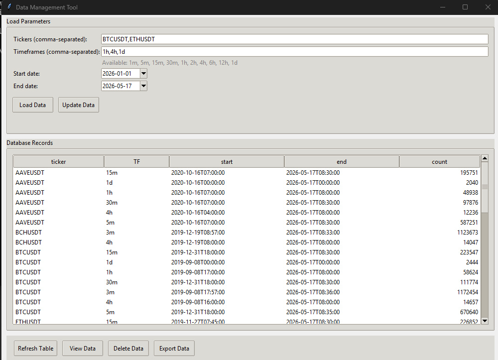
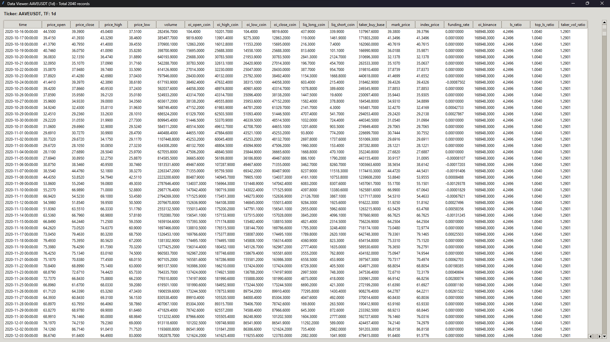
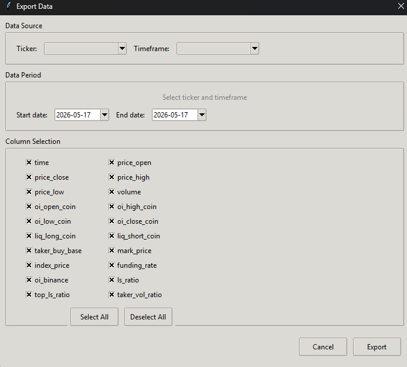

# Crypto Data Management Tool

An advanced, desktop-based local data warehouse designed to **download, store, manage, and flexibly export** comprehensive historical cryptocurrency market data. Built with Python and Tkinter, it provides a clean, zero-configuration graphical interface to aggregate professional-grade metrics from **Binance** and **Coinalyze** into an offline SQLite database.

---

## 🔥 Key Features

* **Multi-Source Aggregation:** Pulls high-fidelity data directly from Binance FAPI (OHLCV, Mark/Index prices, Funding rates), Binance Vision daily archives (Long/Short ratios, Taker volume ratios), and Coinalyze (Open Interest & Liquidations).
* **Smart Incremental Syncing:** Automatically detects data history gaps or empty columns within your local DB. It strictly downloads *only the missing intervals*, saving bandwidth and respecting API rate limits.
* **Granular CSV Exporting:** Allows you to filter data by ticker, timeframe, and specific date ranges. Instead of saving cluttered multi-gigabyte files, you can check/uncheck exactly which metrics you need.
* **Built-in Interactive Data Viewer:** Inspect millions of database rows inside a responsive tabular interface directly within the app before exporting.

---

## 📸 Interface Preview

### 1. Main Control Panel & Database Summary
Manage your parameters, review exactly what ranges are already saved in your local database, and initiate incremental data updates in one click.



### 2. High-Density Data Viewer
Inspect every single downloaded candle along with all 20+ derivative trading metrics simultaneously.



### 3. Customized Data Export Window
Tailor your dataset exports by selecting precise asset ticker pairs, custom date ranges, and filtering out columns you don't need.



---

## 📊 Supported Metrics & Database Schema

The application handles 20 distinct data points for every timestamp, unifying raw price action with order book and derivative market intelligence:

| Category | Column Name | Description | Source |
| :--- | :--- | :--- | :--- |
| **Price Action** | `time`, `price_open`, `price_close`, `price_high`, `price_low` | Standard OHLC candlestick data | Binance |
| **Volume** | `volume`, `taker_buy_base` | Total traded volume and underlying taker buy asset volume | Binance |
| **Market Anchors** | `mark_price`, `index_price` | Fair mark price and underlying spot index asset price | Binance |
| **Funding** | `funding_rate` | Historical funding rate values per interval | Binance |
| **Coinalyze Metrics** | `oi_open_coin`, `oi_high_coin`, `oi_low_coin`, `oi_close_coin` | Open Interest actions calculated in native coin values | Coinalyze |
| **Liquidations** | `liq_long_coin`, `liq_short_coin` | Estimated long and short positions liquidation volume | Coinalyze |
| **Sentiment Ratios** | `oi_binance`, `ls_ratio`, `top_ls_ratio`, `taker_vol_ratio` | Binance-specific Open Interest, Long/Short ratios (global & top traders), and Taker volume buy/sell dynamics | Binance Vision |

---

## 🛠 Tech Stack

* **GUI Architecture:** Python Tkinter / Advanced TTK (`clam` modern styling)
* **Data Processing & Merging:** Pandas (via optimized `merge_asof` timeline alignment)
* **Storage Engine:** SQLite3 (Self-contained, index-optimized auto-migrations)
* **Concurrency:** Thread-pool execution for parallel API chuck downloading

⚠️ **CRITICAL: Database Philosophy (Data Retention)**
The local SQLite database strictly follows an **append-only / incremental** sync philosophy. 
* **DO NOT** open Pull Requests that overwrite, truncate, or reset historical rows.
* **Why?** External endpoints (specifically Coinalyze) only provide a limited lookback window of historical data (e.g., the last 2000 candles). Once this data is saved in your local `market_data.db`, it is irreplaceable. Any changes to the core sync engine must strictly preserve already existing database history.

---

## 📦 Installation & Quick Start

### 1. Clone the repository

```bash
git clone [https://github.com/YOUR_USERNAME/crypto-data-manager.git](https://github.com/YOUR_USERNAME/crypto-data-manager.git)
cd crypto-data-manager
```

2. Install required packages
```Bash
pip install -r requirements.txt
```
3. Environment Setup (Optional)

Rename .env.example to .env and fill in your Coinalyze API key to unlock Open Interest and Liquidations tracking:
```
API_KEY_COINALYZE=your_api_key_here
```
4. Run the Tool
```
python main.py

```

📌 Note on Database Location: On the first execution, the tool automatically sets up and optimizes market_data.db directly inside the root folder.

🤝 Contributing

Contributions are heavily encouraged! If you want to integrate new exchange sources, optimize SQLite write speeds, or implement interactive charts (Matplotlib/Plotly integration), feel free to fork the repository, open an issue, or submit a Pull Request.

# 🚨 PROJECT LOOKING FOR LEAD MAINTAINERS
I am no longer actively developing this project due to time constraints, but I believe it has huge potential. If you want to take over, implement async architecture, or drive the roadmap, please open an issue or drop a comment. I am ready to grant full maintainer/admin access to active contributors!

---

## 🗺️ Roadmap (Upcoming Features)

We are actively working on expanding the tool's capabilities. Here is what's coming next (Pull Requests are highly appreciated!):

* [ ] **Asyncio Refactoring:** Transitioning the network layer from `requests` to `aiohttp` / `asyncio`. The goal is to drastically speed up the "Update Data" process for multi-ticker/timeframe setups while strictly managing API rate limits via semaphores.
* [ ] **On-the-fly Indicators Export:** Adding the ability to calculate and attach technical indicators (RSI, MACD, Bollinger Bands) and order flow metrics (like **CVD** - Cumulative Volume Delta) dynamically during the CSV export process. This keeps the SQLite database lightweight while providing ML-ready datasets.
* [ ] **Data Integrity Checks:** Automated validation tools to find and patch historical gaps inside the local database.

---

## 📄 License

This project is licensed under the **GNU General Public License v3.0 (GPLv3)** — see the [LICENSE](LICENSE) file for details. 

This guarantees that the software remains free and open-source forever. Anyone modifying or distributing this software or its derivative works is strictly required to share their source code under the same GPLv3 license.
